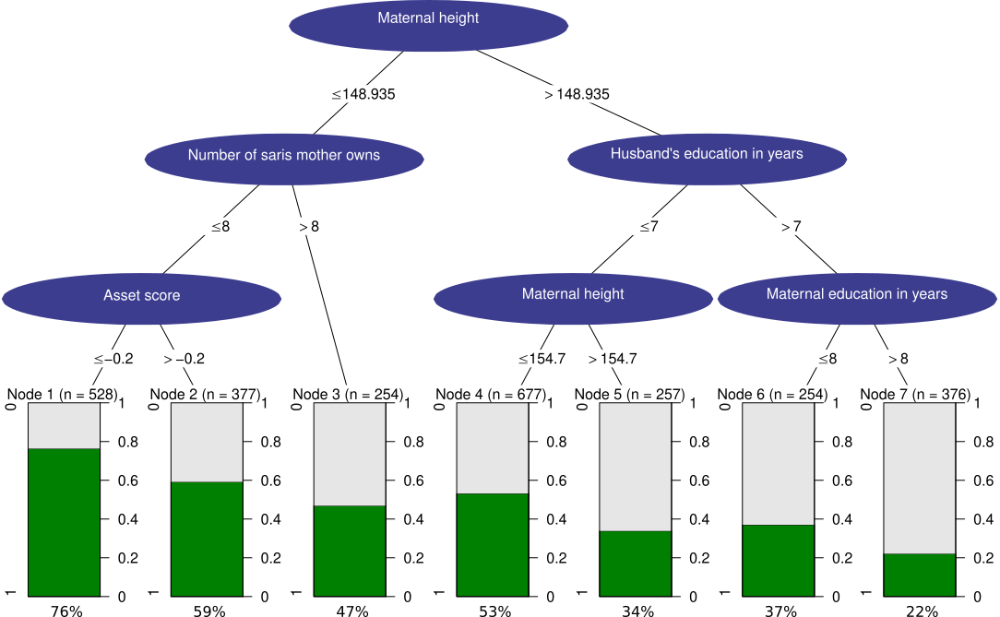

```{r setup, include=FALSE}
library(ggplot2)
library(dplyr)
library(gridExtra)
library(plotly)
library(shiny)
library(gridExtra)
library(grid)
knitr::opts_chunk$set(echo = TRUE)
```

# Task 1

In figure 1 our modified version of the figure "tree" is presented. 

```{r echo = FALSE, comment = "", out.height = 700, out.width = 1000, fig.cap = "\\label{fig:En-figur}Figure 1: Modified version of figure tree with the software Inkscape", fig.pos = "H!"}
knitr::include_graphics("./tree.pdf")
```


# Task 2

## 2.1
Reading the SENIC data into R is done by the following code:

```{r}
text <- read.table("SENIC.txt")
names <- c("ID",
           "Length_stay",
           "Age",
           "Infection_risk",
           "Routine_culturing_ratio",
           "Routine_chest_X-ray_ratio",
           "Number_of_beds",
           "Medical_school_affiliation",
           "Region",
           "Average_daily_census",
           "Number_of_nurses",
           "Available_facilities_and_services")
colnames(text) <- names
```

## 2.2 a&b
The code for our function that calculates the outliers is as follows.

```{r}
create_quantile <- function(vec){
  quantiles <- quantile(vec, probs = c(0.25, 0.75))
  upper_limit <- quantiles[2] + 1.5*(quantiles[2]-quantiles[1])
  lower_limit <- quantiles[1] - 1.5*(quantiles[2]-quantiles[1])
  
  # Returns the indices of the outlying observations,
  outliers <- which(vec < lower_limit | vec > upper_limit)
  return(outliers)
}
```

## 2.3
Figure 2 presents a density plot for the variable infection risk. 

```{r echo = FALSE, comment = "", fig.height = 5, fig.width = 7, fig.cap = "\\label{fig:En-figur}Figure 2: Density plot for infection risk with location of outliers plotted in red", fig.pos = "H!"}
outliers <- create_quantile(text$Infection_risk)

plot_2.3 <- 
  ggplot(text) +
  geom_density(aes(x = Infection_risk),
               fill="lightslategray") +
  geom_point(data=text[outliers,],
             size=3, 
             aes(x=Infection_risk,y=0),
             shape=5,
             color="red",
             stroke = 1) +
  labs(x = "Infection Risk",
       y = "Density") +
  theme_bw() +
  theme(axis.title.y = element_text(angle=0, vjust=0.5))

plot_2.3
```

Most of the values in the data for infection risk is between values 3 and 6. The outliers are identified for infection risk values under 1.4 and over 7.6.


## 2.4
For all other variables in the dataset SENIC, their respective density plot are presented in figure 3. 

```{r echo = FALSE, comment = "", fig.height = 7, fig.width = 9, fig.cap = "\\label{fig:En-figur}Figure 3: Density plot for infection risk with location of outliers plotted in red", fig.pos = "H!"}
data <- text[, c(-1,-4)]
names <- c("Length_stay",
           "Age",
           "Routine_culturing_ratio",
           "Routine_chest_X-ray_ratio",
           "Number_of_beds",
           "Medical_school_affiliation",
           "Region",
           "Average_daily_census",
           "Number_of_nurses",
           "Available_facilities_and_services")

plot_variabel <- function(text, i){
  outliers <- create_quantile(text[, i])
  if(!(length(outliers)==0)){
      ggplot(text) +
      geom_density(aes(x = text[,i]),
                   fill="lightslategray") +
      geom_point(data=text[outliers, ],
                 aes(x=text[outliers, i],y=0),
                 shape=5,
                 size=2,
                 color="red",
                 stroke=1) +
      labs(x = names(text[i]),
           y = "Density") +
      theme_bw()
  } else {
      ggplot(text) +
      geom_density(aes(x = text[,i]),
                   fill="lightslategray") +
      labs(x = names(text[i]),
           y = "Density") +
      theme_bw()
  }
}

layout_matrix <- rbind(c(1,2,3),
                       c(4,5,6),
                       c(7,8,9),
                       c(10,11,11))

plot_list <- list()

# Loop through the variables to plot
for(index in 1:10){
  plot_list[[index]] <- plot_variabel(data, names[index])
}

grid.arrange(grobs=plot_list,
             layout_matrix=layout_matrix)

```

From figure 3 the following variables does not have any outliers according to our function: "Region" and "Available facilities and services". The variables "Region" and "Medical school affiliation" are categorical and a histogram could be a better option than a density plot. The average length of stay appears to be between 6 and 12 days, however there are a few outliers where the hospital with the longest average stay was 19.56 days.


## 2.5
```{r echo = FALSE, comment = "", fig.height = 5, fig.width = 7, fig.cap = "\\label{fig:En-figur}Figure 4: Density plot for infection risk with location of outliers plotted in red", fig.pos = "H!"}
ggplot(text) + geom_point(aes(x=Number_of_nurses, y=Infection_risk, color = Number_of_beds)) +
  scale_color_gradient(low = "red", high = "green") +
  ggtitle("Dependence of Infection risk on the Number of nurses") +
  labs(x = "Number of nurses",
       y = "Infection risk",
       color = "Number of beds") +
  theme_bw() +
  theme(axis.title.y = element_text(angle=0, vjust=0.5))
```

In figure 4 the dependency between variables can be studied, which can not be studied with figure 3 where only density plots are presented. Within the range of 14 and 200 nurses, it appears that the infection risk increases when the number of nurses increases. For hospitals with over 200 nurses, the increase of number of nurses does not appear to affect the infection risk. The number of beds does not appear to have any correlaton with infection risk. Hospitals with a larger number of nurses appears to have a larger number of beds.
The color scale for number of beds is red for lower values and green for higher values. People with red–green color blindness could have a hard time to distinguish values. When using a color scale for a continuous variable it can be hard to distinguish values that are similar to each other.

## 2.6

```{r echo = FALSE, comment = "", fig.height = 5, fig.width = 7, fig.cap = "\\label{fig:En-figur}Figure 5: Density plot for infection risk with location of outliers plotted in red with additional functionality to modify the figure", fig.pos = "H!"}
ggplotly(plot_2.3)
```

In figure 5 compared to figure 2 we can hover points in the figure, which will show the infection risk and the density value of the figure. A few additional functionality with ggplotly are: saving the plot as a png and ability to zoom in to various parts of the figure. Compared to figure 2 the y-axis title is vertical instead of horisontal.

## 2.7

In figure 6 a histogram of the variable infection risk is presented.
```{r echo = FALSE, comment = "", fig.height = 5, fig.width = 7, fig.cap = "\\label{fig:En-figur}Figure 6: Histogram for infection risk made with Plotly", fig.pos = "H!"}
myPlot <- text %>%  plot_ly(x=~Infection_risk) %>% 
  add_fun(function(plot) {
    plot %>% 
      slice(create_quantile(Infection_risk)) %>% group_by(Infection_risk) %>% mutate(countY=n()) %>% 
      add_markers(y = ~countY, marker = list(symbol = "diamond", size = 8,color ="red"))
  }) %>% 
  add_histogram(
    marker = list(color = "lightslategray", line = list(color = "black", width = 1))
  ) %>%
  layout(
    title = "Infection Risk Analysis",
    xaxis = list(title = "Infection Risk"),
    yaxis = list(title = "Count"),
    showlegend = FALSE
  )    

myPlot
```

In figure 6 the outliers are counted and there are 2 outliers with the value 1.3.


## 2.8

```{r echo = FALSE, comment = "", out.height = 700, out.width = 1000, fig.pos = "H!"}
data <- text[, c(-1,-4)]
names <- c("Length_stay",
           "Age",
           "Routine_culturing_ratio",
           "Routine_chest_X-ray_ratio",
           "Number_of_beds",
           "Medical_school_affiliation",
           "Region",
           "Average_daily_census",
           "Number_of_nurses",
           "Available_facilities_and_services")
# User interface
ui <- fluidPage(
  sliderInput(inputId="ws", 
              label="Choose bandwidth size",
              value=0.1,
              min=0.1, 
              max=1),
  checkboxGroupInput(inputId="variable", 
                     label ="Variables to plot",
                     c("Length of stay" = "Length_stay",
                       "Age" = "Age",
                       "Routine culturing ratio" = "Routine_culturing_ratio",
                       "Routine chest X-ray ratio" = "Routine_chest_X-ray_ratio",
                       "Number of beds" = "Number_of_beds",
                       "Medical school affiliation" = "Medical_school_affiliation",
                       "Region" = "Region",
                       "Average daily census" = "Average_daily_census",
                       "Number of nurses" = "Number_of_nurses",
                       "Available facilities and services" = "Available_facilities_and_services"),
                     selected = c("Length_stay", "Age")
  ),
  plotOutput("densPlot")
  )

server <- function(input, output) {
  plot_variabel <- function(data, i){
    outliers <- create_quantile(data[, i])
    if(!(length(outliers)==0)){
      ggplot(data) +
        geom_density(aes(x = data[,i]),
                     bw=input$ws,
                     fill="lightslategray") +
        geom_point(data=data[outliers, ], 
                   aes(x=data[outliers, i],y=0),
                   shape=5) +
        labs(x = names(data[i]),
             y = "Density") +
        theme_bw()
    } else {
      ggplot(data) +
        geom_density(aes(x = data[,i]),
                     bw=input$ws,
                     fill="lightslategray") +
        labs(x = names(data[i]),
             y = "Density") +
        theme_bw()
    }
  }
  output$densPlot <- renderPlot({
    plot_list <- list()
    # Which variables to plot
    var_to_plot <- which(names %in% input$variable)
    # Loop through the variables to plot
    for(index in 1:length(input$variable)){
      plot_list[[index]] <- plot_variabel(data, var_to_plot[index])
    }
    
    # Layout to plot
    layout_matrix <- rbind(c(1,2,3),
                           c(4,5,6),
                           c(7,8,9),
                           c(10,11,11))
    
    # Plot
    grid.arrange(grobs=plot_list, layout_matrix=layout_matrix)
  })
}

shinyApp(ui = ui, server = server)
```

For the categorical variables "Medical school affiliation" and "Region" bandwidth 0.1 is best, this is due to the reason it mostly resembles a histogram. For all the other variables it is hard to assume a distribution.
For bandwidth value 1 it is easier to visualise a distribution for the non categorical variables, however the distribution of the categorical variables can be misinterpreted. 
From our point of view there is no optimal bandwidth that suits all graphs simultaneously. 


## Statement of Contribution
We both worked on all task, some together and a few separate. For the end result we compared our solutions and discussed which one to use. 

### Task 1
Both worked on the same computer editing the picture.

### Task 2
Both worked on the same computer for the tasks: 2.1, 2.2, 2.6, 2.7 and 2.8.

For task 2.3 and 2.4 we used the solution from Duc. 

For task 2.5 we used the solution from William. 

For task 2.7 the code to count the frequencies are from William


## Appendix 

### Task 1
Modified tree picture for task 1 in png format.
```{r, echo=FALSE}

```

### Task 2
Following code is used to solve task 2

```{r, eval=FALSE}

# Task 2.1
text <- read.table("SENIC.txt")
names <- c("ID",
           "Length_stay",
           "Age",
           "Infection_risk",
           "Routine_culturing_ratio",
           "Routine_chest_X-ray_ratio",
           "Number_of_beds",
           "Medical_school_affiliation",
           "Region",
           "Average_daily_census",
           "Number_of_nurses",
           "Available_facilities_and_services")
colnames(text) <- names


# Task 2.2 a&b
create_quantile <- function(vec){
  quantiles <- quantile(vec, probs = c(0.25, 0.75))
  upper_limit <- quantiles[2] + 1.5*(quantiles[2]-quantiles[1])
  lower_limit <- quantiles[1] - 1.5*(quantiles[2]-quantiles[1])
  
  # Returns the indices of the outlying observations,
  outliers <- which(vec < lower_limit | vec > upper_limit)
  return(outliers)
}


# Task 2.3
outliers <- create_quantile(text$Infection_risk)

plot_2.3 <- 
  ggplot(text) +
  geom_density(aes(x = Infection_risk),
               fill="lightslategray") +
  geom_point(data=text[outliers,],
             size=3, 
             aes(x=Infection_risk,y=0),
             shape=5,
             color="red",
             stroke = 1) +
  labs(x = "Infection Risk",
       y = "Density") +
  theme_bw() +
  theme(axis.title.y = element_text(angle=0, vjust=0.5))

plot_2.3


# Task 2.4
## Subset the data
data <- text[, c(-1,-4)]
names <- c("Length_stay",
           "Age",
           "Routine_culturing_ratio",
           "Routine_chest_X-ray_ratio",
           "Number_of_beds",
           "Medical_school_affiliation",
           "Region",
           "Average_daily_census",
           "Number_of_nurses",
           "Available_facilities_and_services")

# Plot function taking into account of outliers
plot_variabel <- function(text, i){
  outliers <- create_quantile(text[, i])
  if(!(length(outliers)==0)){
      ggplot(text) +
      geom_density(aes(x = text[,i]),
                   fill="lightslategray") +
      geom_point(data=text[outliers, ],
                 aes(x=text[outliers, i],y=0),
                 shape=5,
                 size=2,
                 color="red",
                 stroke=1) +
      labs(x = names(text[i]),
           y = "Density") +
      theme_bw()
  } else {
      ggplot(text) +
      geom_density(aes(x = text[,i]),
                   fill="lightslategray") +
      labs(x = names(text[i]),
           y = "Density") +
      theme_bw()
  }
}

layout_matrix <- rbind(c(1,2,3),
                       c(4,5,6),
                       c(7,8,9),
                       c(10,11,11))

plot_list <- list()

# Loop through the variables to plot
for(index in 1:10){
  plot_list[[index]] <- plot_variabel(data, names[index])
}

grid.arrange(grobs=plot_list,
             layout_matrix=layout_matrix)


# Task 2.5
ggplot(text) + geom_point(aes(x=Number_of_nurses, y=Infection_risk, color = Number_of_beds)) +
  scale_color_gradient(low = "red", high = "green") +
  ggtitle("Dependence of Infection risk on the Number of nurses") +
  labs(x = "Number of nurses",
       y = "Infection risk",
       color = "Number of beds") +
  theme_bw() +
  theme(axis.title.y = element_text(angle=0, vjust=0.5))


# Task 2.6
ggplotly(plot_2.3)


# Task 2.7
myPlot <- text %>%  plot_ly(x=~Infection_risk) %>% 
  add_fun(function(plot) {
    plot %>% 
      slice(create_quantile(Infection_risk)) %>% group_by(Infection_risk) %>% mutate(countY=n()) %>% 
      add_markers(y = ~countY, marker = list(symbol = "diamond", size = 8,color ="red"))
  }) %>% 
  add_histogram(
    marker = list(color = "lightslategray", line = list(color = "black", width = 1))
  ) %>%
  layout(
    title = "Infection Risk Analysis",
    xaxis = list(title = "Infection Risk"),
    yaxis = list(title = "Count"),
    showlegend = FALSE
  )    

myPlot


# Task 2.8
## User interface
ui <- fluidPage(
  sliderInput(inputId="ws", 
              label="Choose bandwidth size",
              value=0.1,
              min=0.1, 
              max=1),
  checkboxGroupInput(inputId="variable", 
                     label ="Variables to plot",
                     c("Length of stay" = "Length_stay",
                       "Age" = "Age",
                       "Routine culturing ratio" = "Routine_culturing_ratio",
                       "Routine chest X-ray ratio" = "Routine_chest_X-ray_ratio",
                       "Number of beds" = "Number_of_beds",
                       "Medical school affiliation" = "Medical_school_affiliation",
                       "Region" = "Region",
                       "Average daily census" = "Average_daily_census",
                       "Number of nurses" = "Number_of_nurses",
                       "Available facilities and services" = "Available_facilities_and_services"),
                     selected = c("Length_stay", "Age")
  ),
  plotOutput("densPlot")
  )

server <- function(input, output) {
  plot_variabel <- function(data, i){
    outliers <- create_quantile(data[, i])
    if(!(length(outliers)==0)){
      ggplot(data) +
        geom_density(aes(x = data[,i]),
                     bw=input$ws,
                     fill="lightslategray") +
        geom_point(data=data[outliers, ], 
                   aes(x=data[outliers, i],y=0),
                   shape=5) +
        labs(x = names(data[i]),
             y = "Density") +
        theme_bw()
    } else {
      ggplot(data) +
        geom_density(aes(x = data[,i]),
                     bw=input$ws,
                     fill="lightslategray") +
        labs(x = names(data[i]),
             y = "Density") +
        theme_bw()
    }
  }
  output$densPlot <- renderPlot({
    plot_list <- list()
    # Which variables to plot
    var_to_plot <- which(names %in% input$variable)
    # Loop through the variables to plot
    for(index in 1:length(input$variable)){
      plot_list[[index]] <- plot_variabel(data, var_to_plot[index])
    }
    
    # Layout to plot
    layout_matrix <- rbind(c(1,2,3),
                           c(4,5,6),
                           c(7,8,9),
                           c(10,11,11))
    
    # Plot
    grid.arrange(grobs=plot_list, layout_matrix=layout_matrix)
  })
}

shinyApp(ui = ui, server = server)
```

