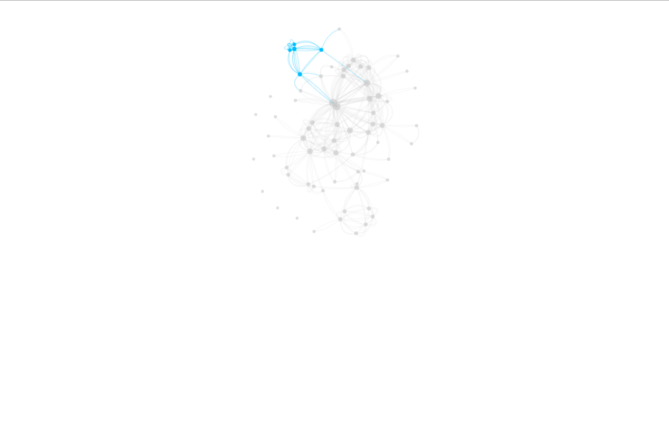

\captionsetup[table]{name = Table}
\setcounter{table}{0}
\captionsetup[figure]{name = Figure}
\setcounter{figure}{0}

```{r setup, include=FALSE}
knitr::opts_chunk$set(echo = TRUE)
```


# Task 1
In this task the data are read into r with the following code:

```{r, message=FALSE, warning=FALSE}
library(dplyr)
library(ggplot2)
library(seriation)
library(plotly)
library(igraph)
library(visNetwork)
# Links
edges <- read.table("trainData.dat")
colnames(edges) <- c("from", "to", "weight")  
edges$width <- edges$weight
edges$type <- "hyperlink"


# Nodes
nodes <- read.table("trainMeta.dat")
colnames(nodes) <- c("label", "group")
nodes$id <- 1:70
nodes$group <- as.character(nodes$group)
nodes$value <- 0
nodes$label[17] <- "Ali Amrous"
nodes$label[21] <- "Jose Emilio Suarez"
```

Observation 17 and 21 had special characters in the name and had to be renamed. 

## 1.1 

**Question:** Use visNetwork package to plot the graph in which:

a. you use strength of links variable  
b. nodes are colored by Bombing Group.  
c. size of nodes is proportional to the number of connections ( function strength() from IGRAPH might be useful here)  
d. you use a layout that optimizes repulsion forces (visPhysics(solver=”repulsion”)).  
e. all nodes that are connected to a currently selected node by a path of length one are highlighted  


**Solution:** The following code is used and the result is presented in figure 1. 

```{r, warning=FALSE, fig.width=7, fig.height=7, fig.cap = "\\label{} Figure 1: Graph network where selected node will highlight all nodes connected by a path of length one. Red node presents persons involved in the bombing group and blue for all other persons not involved."}
# 1.c 
# Counts number of edges from a node
num_connection <- count(edges, from)
for(i in 1:64){
  index <- which(nodes$id == num_connection$from[i])
  nodes$value[index] <- num_connection$n[i]
}
# Counts number of edges to a node
num_connection <- count(edges, to)
for(i in 1:64){
  index <- which(nodes$id == num_connection$to[i])
  nodes$value[index] <- nodes$value[index] + num_connection$n[i]
}
# Size is proportional 
nodes$value <- nodes$value / sum(nodes$value)


visNetwork(nodes, edges) %>% 
  # 1.a Strength of links/edges is presented as width of the lines. 
  # 1.b
  visGroups(groupname = "0", color = "deepskyblue") %>%
  visGroups(groupname = "1", color = "indianred") %>%
  # 1.d
  visPhysics(solver="repulsion") %>%
  # 1.e
  visOptions(highlightNearest = list(enabled = TRUE, degree = 1)) %>%
  # Same orientation of picture each time
  visLayout(randomSeed = 13)
```

**Question:** Analyse the obtained network, in particular describe which clusters you see in the network.

**Solution:** We identified three clusters which are presented in the following three figures. The hubs in the first figure is Mamoun Darkazanli, the second figure Jamal Zougam, and the third figure El Gitanillo. Only in the second cluster there were people connected to group involved in bombing. An interesting part when comparing figure 1 and the clusters is that we were not able to cluster five of the persons involved in the bombings, which are the four people in the left and the most right person that were in the bombing group. 




## 1.2

**Question:** Add a functionality to the plot in step 1 that highlights all nodes that are connected to the selected node by a path of length one or two. Check some amount of the largest nodes and comment which individual has the best opportunity to spread the information in the network. Read some information about this person in Google and present your findings.

**Solution:**
```{r, warning=FALSE, fig.width=7, fig.height=7, fig.cap = "\\label{} Figure 2: Graph network where selected node will highlight all nodes connected by a path of length one or two. Red node presents persons involved in the bombing group and blue for all other persons not involved."}

# Code is similar to 1.1, only change is degree=2 instead of 1. 
visNetwork(nodes, edges) %>% 
  visGroups(groupname = "0", color = "deepskyblue") %>%
  visGroups(groupname = "1", color = "indianred") %>%
  visPhysics(solver="repulsion") %>%
  visOptions(highlightNearest = list(enabled = TRUE, degree = 2)) %>%
  visLayout(randomSeed = 13)
```

We identified that Jamal Zougam had one of the largest network with a distance of two. On wikipedia, we found out that he was convicted of 191 charges of murder for the 2004 madrid train bombings.

## 1.3

**Question:** Compute clusters by optimizing edge betweenness and visualize the resulting network.

**Solution:** 
```{r, warning=FALSE}
edges <- edges[, c(1,2,5,3,4)]
nodes <- nodes[, c(3,1,2,4)]
nodes1 <- nodes
net <- graph_from_data_frame(d=edges, vertices=nodes, directed=F)
ceb <- cluster_edge_betweenness(net) 
nodes1$group=ceb$membership
```


**Question:** Comment whether the clusters you identified manually in step 1 were also discovered by this clustering method.

**Solution:** 
```{r, warning=FALSE, fig.width=7, fig.height=7, fig.cap = "\\label{} Figure 3: Graph network where selected node will highlight all nodes connected by a path of length one or two. "}
visNetwork(nodes1,edges) %>% visIgraphLayout()
```

In figure 3, the pink cluster is the top cluster we identified in task 1.2. The bottom cluster in task 1.2 was found as the purple cluster in figure 3. The big middle cluster was divided into two clusters in figure 3 as red and blue. 

## 1.4

**Question:** Use adjacency matrix representation to perform a permutation by Hierarchical Clustering (HC) seriation method and visualize the graph as a heatmap. Find the most pronounced cluster and comment whether this cluster was discovered in steps 1 or 3.

**Solution:**

```{r, warning=FALSE, fig.width=7, fig.height=7, fig.cap = "\\label{} Figure 4: Graph network where selected node will highlight all nodes connected by a path of length one or two. "}
netm <- get.adjacency(net, attr="weight", sparse=F)
colnames(netm) <- V(net)$media
rownames(netm) <- V(net)$media

rowdist<-dist(netm)

order1<-seriate(rowdist, "HC")
ord1<-get_order(order1)

reordmatr<-netm[ord1,ord1]


plot_ly(z=~reordmatr, x=~colnames(reordmatr), 
        y=~rownames(reordmatr), type="heatmap")
```

The most prominent cluster is in the upper right corner, from observation 60 to 70. In task 1, only 3 of these persons were identified in the bottom cluster and in task 3, 6 of these were in the purple cluster.


# Task 2

The data for this task is read into R with the following code:

```{r}

library(plotly)
library(ggplot2)
library(seriation)
library(dplyr)
library(tidyr)
library(tourr)
library(scales)

oilcoal <- read.csv2("Oilcoal.csv")
# Removed empty column 
oilcoal <- oilcoal[,-6]
```


## 2.1

**Question:** 
Visualize data in Plotly as an animated bubble chart of Coal versus Oil in which the bubble size
corresponds to the country size

**Solution:**
```{r echo = TRUE, warning=FALSE, out.width="100%", out.height="100%", fig.cap = "\\label{} Figure 5: Animated bubble chart of Coal versus Oil in which the bubble size corresponds to the country size"}


plot_ly(oilcoal, x =~Coal, y =~Oil, frame =~Year, color = ~Country) %>% 
        add_markers(size = ~Marker.size, text =~Country) %>%
        animation_opts(200, easing = "linear", redraw = F) %>% 
        layout(
          legend = list(
            orientation = "v",
            x = 1.1,
            y = 0.7,
            title = list(text = "Countries")
          )
        )


```

**Question:** 

List several noteworthy features of the investigated animation.

**Solution:**

It can be observed that most countries increase their oil consumption between 1965 and 1975.
The increase in oil consumption slows down for most countries after that period, except for Brazil and India, which continue to increase their oil consumption until 2009.


Regarding coal consumption, Germany and United Kingdom have a steady decrease.
For three countries: USA, India, and China the coal consumption increased.
China stands out the most, as it experiences a extreme increase in coal consumption from 2002 to 2009,
from under 700 million tonnes to over 1500 million tonnes.


# 2.2

**Question:** 
Find two countries that had similar motion patterns and create a motion chart including these
countries only.

**Solution:**

```{r echo = TRUE, warning=FALSE, out.width="100%", out.height="100%", fig.cap = "\\label{} Figure 6: Animated bubble chart of Coal versus Oil in which the bubble size corresponds to the country size for country China & India"}

filtered_data <- oilcoal %>% 
  filter(Country %in% c("China", "India"))


plot_ly(filtered_data, x =~Coal, y =~Oil, frame =~Year, color = ~Country) %>% 
  add_markers(size = ~Marker.size, text =~Country) %>%
  animation_opts(200, easing = "linear", redraw = F) %>% 
  layout(
    legend = list(
      orientation = "v",
      x = 1.1,
      y = 0.7,
      title = list(text = "Countries")
    )
  )
```


**Question:** 
Try to find historical facts that could explain some of the sudden changes in the
animation behavior


**Solution:**
Two countries that had similar patterns of coal and oil consumption between 1965-2009 were China and India.
Both countries experienced a significant relative increase in the consumption of coal and oil.
The reason for the increase for Coal between 2000-2009 in both China and
India could be connected to the economic growth during those years, 
leading to a greater dependent on coal as an energy source.


The continuous increase in oil consumption between 1965-2009 is due
to urbanization and the growth of the population, as it results in a higher
demand for transportation and energy.

# 2.3

**Question:** 

Compute a new column that shows the proportion of fuel consumption related to oil: 

$$Oil_p = \frac{Oil}{Oil+Coal} \cdot 100$$
One could think of visualizing the proportions $Oil_p$ by means of animated bar
charts; however smooth transitions between bars are not yet implemented in Plotly. Thus, use
the following workaround:

**a)** Create a new data frame that for each year and country contains two rows: one that
shows $Oil_p$ and another row containing 0 in $Oil_p$ column

**Solution:**

```{r echo = TRUE, warning=FALSE, out.width="100%", out.height="100%"}

oilcoal$oil_p <- oilcoal$Oil / (oilcoal$Oil + oilcoal$Coal) * 100

# 2.3 a)

# Duplicate each row and sorting by country and then year
new_data <- oilcoal %>% bind_rows(., .)  %>%  arrange(Country, Year) 

# adding a 0 to varannan rad
new_data[c(FALSE, TRUE), 6] <- 0

```

**Question:** 

**b)** Make an animated line plot of $Oil_p$ versus Country where you group lines by Country
and make them thicker

**Solution:**

```{r echo = TRUE, warning=FALSE, out.width="100%", out.height="100%", fig.cap = "\\label{} Figure 7: Animated line plot of $Oil_p$ versus Country"}


plot_ly(new_data,x = ~oil_p, y = ~Country, frame =~Year, color = ~Country) %>% 
  add_trace(type="bar", width = 1) %>% 
  animation_opts(500, easing = "cubic-in-out", redraw = F) %>% 
  layout(
    xaxis = list(title = "Proportion of fuel consumption related to oil"),
    yaxis = list(title = "Country"),
    showlegend = FALSE  # Remove the legend
  )


```

**Question:** 
Perform an analysis of this animation. What are the advantages of visualizing data in this way
compared to the animated bubble chart? What are the disadvantages?

**Solution:**
In the graph, it can be observed that there are two countries, the USA and Brazil,
where the proportion of fuel consumption related to oil does not change much between 
1965-2009.

Next, there are five countries, China, France, Germany, India, and the
United Kingdom, which have an increasing proportion of fuel consumption 
related to oil as you move closer to the present.

There is one country, Japan, 
that has an increasing proportion of fuel consumption related to oil from 1965-1980,
but then has a decreasing proportion of fuel consumption related to oil from 1980-2009.

The advantage of using a graph like this, with a variable describing the proportion between fuel and oil, is that it is easier to see the proportion between of fuel consumption related to oil. In a bubble chart the proportion is not visualized but can be calculted at fixed points. However, a disadvantage of the animated bar chart is that it does not show if the overall consumtions of coal and oil decreases or increases.


# 2.4

**Question:** 

Repeat the previous step but use “elastic” transition (easing).

**Solution:**

```{r echo = TRUE, warning=FALSE, out.width="100%", out.height="100%", fig.cap = "\\label{} Figure 8:  Animated line plot of $Oil_p$ versus Country using easing = elastic"}


plot_ly(new_data,x = ~oil_p, y = ~Country, frame =~Year, color = ~Country) %>% 
  add_trace(type="bar", width = 1) %>% 
  animation_opts(500, easing = "elastic", redraw = F) %>% 
  layout(
    xaxis = list(title = "Proportion of fuel consumption related to oil"),
    yaxis = list(title = "Country"),
    showlegend = FALSE  # Remove the legend
  )


```

**Question:** 

Which advantages and disadvantages can you see with this animation?

**Solution:**

The disadvantages of using 'elastic' are that the animation becomes very stuttering
and not as smooth as 'cubic-in-out', making it unpleasant for the viewer.

The advantage of using 'elastic' is that the actual values are more pronounced compared to 
'cubic-in-out' where a lot of values that you see is interpolated.


# 2.5

**Question:** 

Use Plotly to create a guided 2D-tour visualizing Coal consumption in which the index function is
given by Central Mass index and in which observations are years and variables are different
countries.

**Solution:**

```{r echo = TRUE, warning=FALSE, message=FALSE, fig.cap = "\\label{} Figure 9: Guided 2D-tour visualizing Coal consumption in which the index function is given by Central Mass index and in which observations are years and variables are different countries"}
oilcoal <- read.csv2("Oilcoal.csv")
# Removed empty column 
oilcoal <- oilcoal[,c(-4, -5,-6)]

oilcoal <- oilcoal %>%
  pivot_wider(names_from = Country, values_from = Coal)
radnamn <- oilcoal$Year

oilcoal <- data.matrix(oilcoal[, -1])
oilcoal <- rescale(oilcoal)
rownames(oilcoal) <- radnamn
set.seed(12345)
mat <- oilcoal

tour<- new_tour(mat, guided_tour(cmass), NULL)

steps <- c(0, rep(1/15, 200))
Projs<-lapply(steps, function(step_size){  
  step <- tour(step_size)
  if(is.null(step)) {
    .GlobalEnv$tour<- new_tour(mat, guided_tour(cmass), NULL)
    step <- tour(step_size)
  }
  step
}
)

# projection of each observation
tour_dat <- function(i) {
  step <- Projs[[i]]
  proj <- center(mat %*% step$proj)
  data.frame(x = proj[,1], y = proj[,2], state = rownames(mat))
}

# projection of each variable's axis
proj_dat <- function(i) {
  step <- Projs[[i]]
  data.frame(
    x = step$proj[,1], y = step$proj[,2], variable = colnames(mat)
  )
}

stepz <- cumsum(steps)

# tidy version of tour data

tour_dats <- lapply(1:length(steps), tour_dat)
tour_datz <- Map(function(x, y) cbind(x, step = y), tour_dats, stepz)
tour_dat <- dplyr::bind_rows(tour_datz)

# tidy version of tour projection data
proj_dats <- lapply(1:length(steps), proj_dat)
proj_datz <- Map(function(x, y) cbind(x, step = y), proj_dats, stepz)
proj_dat <- dplyr::bind_rows(proj_datz)

ax <- list(
  title = "", showticklabels = FALSE,
  zeroline = FALSE, showgrid = FALSE,
  range = c(-1.1, 1.1)
)

# for nicely formatted slider labels
options(digits = 3)
tour_dat <- highlight_key(tour_dat, ~state, group = "A")
tour <- proj_dat %>%
  plot_ly(x = ~x, y = ~y, frame = ~step, color = I("black")) %>%
  add_segments(xend = 0, yend = 0, color = I("gray80")) %>%
  add_text(text = ~variable) %>%
  add_markers(data = tour_dat, text = ~state, ids = ~state, hoverinfo = "text") %>%
  layout(xaxis = ax, yaxis = ax)#%>%animation_opts(frame=0, transition=0, redraw = F)
tour


```

**Question:** 

Find a projection with the most compact and well-separated clusters. Do clusters
correspond to different Year ranges? Which variable has the largest contribution to this
projection? How can this be interpreted?

**Solution:**


In the figure above we have captured the projection with the most compact and well-separated clusters
from the 2D-tuor. 
When we include the 2d-tour in the RMD it does not look the same as when we run it in R.
There are two clusters, first one can be seen at the bottom left and the other can be seen top right.
The cluster at the bottom right have the year range 1965 to 1983 and the other cluster have the year range 1985 to 2009.
The variables that has the largest contribution to this projection is Brazil and US.
Brazil and US have the same pattern in coal consumption, they both have a increasing consumption over the years.


## Statement of Contribution
We worked on the tasks individually before the data labs, Duc on task 1 and William on task 2. We later solved the other task and compared our solutions. 

### Task 1

Most of the text written by Duc 

### Task 2

Most of the text written by William.


