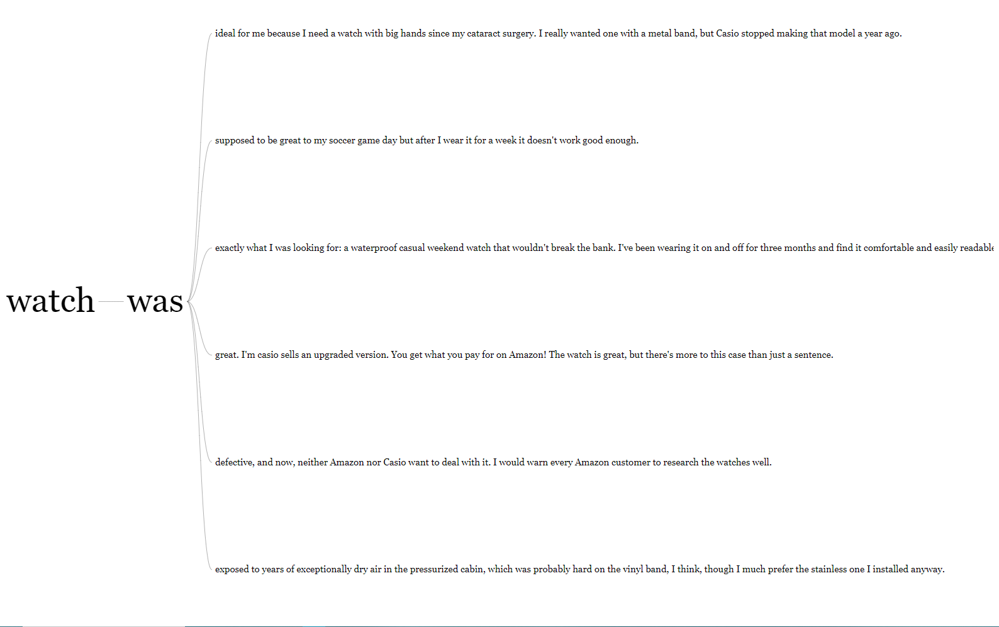

\captionsetup[table]{name = Table}
\setcounter{table}{0}
\captionsetup[figure]{name = Figure}
\setcounter{figure}{0}

```{r setup, include=FALSE}
knitr::opts_chunk$set(echo = TRUE)
```


# Assignment 1

The data for this task is read into R with the following code:

```{r warning=FALSE, message=FALSE}

library(tidytext)
library(dplyr)
library(tidyr)
library(readr)
library(wordcloud)
library(RColorBrewer)
library(textdata)
library(plotly)
library(ggplot2)
library(visNetwork)


five <- read_lines("Five.txt")
oneTwo <- read_lines("OneTwo.txt")

```


Files *Five.txt* and *OneTwo.txt* contain feedbacks of the customers who
were pleased and not pleased with their buy, respectively. 

*Five.txt* have 116 rows of text.
*OneTwo.txt* have 101 rows of text.


## 1.1

**Question:** 
Visualize word clouds corresponding to *Five.txt* and *OneTwo.txt* and make sure that stop words are removed.

**Solution:**
```{r echo = TRUE,warning=FALSE, message=FALSE, out.width="100%", out.height="100%", fig.cap = "\\label{} Figure 1: Word clouds corresponding to Five.txt"}


# Five.txt
textFrame <- tibble(text = five) %>% mutate(line = row_number())
pal <- brewer.pal(6, "Dark2")

tidy_frame1 <- textFrame %>% 
  unnest_tokens(word, text) %>% # Divides every row of text into individual words
  anti_join(stop_words) %>% # Removes stopwords
  count(word) %>% 
  with(wordcloud(word, # Prints workcloud
                 n,    # Count of each word
                 max.words = 100,
                 colors = pal,
                 random.order = FALSE)) 


```


```{r echo = TRUE,warning=FALSE, message=FALSE, out.width="100%", out.height="100%", fig.cap = "\\label{} Figure 2: Word clouds corresponding to OneTwo.txt"}


# OneTwo.txt
textFrame <- tibble(text = oneTwo) %>% mutate(line = row_number())
pal <- brewer.pal(6, "Dark2")

tidy_frame2 <- textFrame %>% 
  unnest_tokens(word, text)%>%
  anti_join(stop_words) %>% # Removing stop words
  count(word) %>%
  with(wordcloud(word, 
                 n, 
                 max.words = 100,
                 colors = pal, 
                 random.order = FALSE))

```

**Question:** 

Which words are mentioned most often?

**Solution:**

"Watch" is the word mentioned the most. Then there are the words "casio," "time," "amazon," "price," and "months" that also appear frequently in the texts.


## 1.2

**Question:** 

Without filtering stop words, compute TF-IDF values for *OneTwo.txt* by aggregating each 10 lines into a separate “document”. Afterwards, compute mean TF-IDF values for each word over all documents and visualize them by the word cloud.

**Solution:**

```{r echo = TRUE,warning=FALSE, message=FALSE, out.width="100%", out.height="100%", fig.cap = "\\label{} Figure 3: Word clouds corresponding to OneTwo.txt using mean TF-IDF values"}

# Aggregating each 10 lines into a separate “document”
tidy_frame3 <- textFrame %>%
  unnest_tokens(word, text) %>%
  mutate(line1 = floor(line/10)) %>% # line1 is the documents
  count(line1, word, sort=TRUE) # Counts the number of occurences for a word in each document


# TF-IDF values for each word over all documents
TFIDF <- tidy_frame3 %>% bind_tf_idf(word, line1, n)

# TF-IDF mean
TFIDF_mean <- TFIDF %>%
  group_by(word) %>%
  summarize(mean_tfidf = mean(tf_idf, na.rm = TRUE))

# Word cloud
tidy_frame <- TFIDF_mean %>% 
  with(wordcloud(word, mean_tfidf, max.words = 100, colors=pal, random.order=FALSE))

```


**Question:** 
Compare the plot with the corresponding plot from step 1. What do you think the reason is behind word “watch” being not emphasized in TF-IDF diagram while it is emphasized in the previous
word clouds?


**Solution:**

In this TF-IDF diagram the words "luminesence", "bad", "could" och "shockingly" are more emphasized
than in the plot from step 1. The word "Watch" is not emphasized in this TF-IDF diagram while it is emphasized in the previous word clouds. This is due to the formula

$$TFIDF(w) = Tf(w) \cdot log(N/df(w))$$
$$Tf(w) =  \text{Frequency of word} $$
$$N = \text{Number of documents}$$
$$df(w) = \text{Frequency of word in all documents}$$
where the word "Watch" have $log(N/df(w)) = log(11/11) = 0$ so the $TFIDF(w)$ value is always going to be 0 for the word "Watch" and therefore not be emphasized in this TF-IDF diagram.


## 1.3

**Question:** 

Aggregate data in chunks of 5 lines and compute sentiment values (by using “afinn”
database) for respective chunks in *Five.txt* and for *OneTwo.txt* . Produce plots visualizing
aggregated sentiment values versus chunk index.


**Solution:**

```{r echo = TRUE,warning=FALSE, message=FALSE, out.width="100%", out.height="100%", fig.cap = "\\label{} Figure 4: Aggregated sentiment values versus chunk index for Five.txt"}

# Five.txt
textFrame <- tibble(text = five) %>% mutate(line = row_number())

tidy_frame4 <- textFrame %>% 
  unnest_tokens(word, text) %>% # Divides each sentence into individual words
  left_join(get_sentiments("afinn")) %>% # Get sentiment value for each word
  mutate(line1 = floor(line / 5)) %>% # line1 are the chunks with 5 lines
  group_by(line1, sort = TRUE) %>%
  summarize(Sentiment = sum(value, na.rm = TRUE))

plot_ly(tidy_frame4, x =~line1, y =~Sentiment) %>% add_bars()


```


```{r echo = TRUE,warning=FALSE, message=FALSE, out.width="100%", out.height="100%", fig.cap = "\\label{} Figure 5: Aggregated sentiment values versus chunk index for OneTwo.txt"}


# OneTwo.txt
textFrame <- tibble(text = oneTwo) %>% mutate(line = row_number())

tidy_frame5 <- textFrame %>% unnest_tokens(word, text) %>%
  left_join(get_sentiments("afinn")) %>%
  mutate(line1 = floor(line/5)) %>%
  group_by(line1, sort = TRUE) %>%
  summarize(Sentiment = sum(value, na.rm = T))

plot_ly(tidy_frame5, x =~line1, y =~Sentiment) %>% add_bars()


```

**Question:** 
Make a comparative analysis between these plots. Does sentiment analysis show a connection of the corresponding documents to the kinds of reviews we expect to see in them?

**Solution:**

The sentiment is higher for the *Five.txt* than *OneTwo.txt* for almost all chunks.
All chunks in *Five.txt* have positive sentiment values, where in *OneTwo.txt* there are
7 chunks that have negative sentiment values of total 20 chunks. 

This result is expected, because the *Five.txt* contain feedbacks of the customers who
were pleased and therefore the sentiment values should be higher than *OneTwo.txt* where the 
customers were not pleased.


## 1.4

**Question:** 

Create the phrase nets for *Five.Txt* and *One.Txt* with connector words

* am, is, are, was, were

* at


When you find an interesting connection between some words, use Word Trees
https://www.jasondavies.com/wordtree/ to understand the context better.

**Solution:**

```{r echo = TRUE,warning=FALSE, message=FALSE, out.width="100%",  fig.width=7, fig.height=7,  fig.cap = "\\label{} Figure 6: Phrase net for Five.txt with connector words am, is, are, was, were"}

phraseNet <- function(text, connectors){
  textFrame <- tibble(text=paste(text, collapse=" "))
  tidy_frame3 <- textFrame %>% unnest_tokens(word, text, token="ngrams", n=3) 
  tidy_frame3
  tidy_frame_sep <- tidy_frame3 %>% separate(word, c("word1", "word2", "word3"), sep=" ")
  
  #SELECT SEPARATION WORDS HERE: now "is"/"are"
  tidy_frame_filtered=tidy_frame_sep %>%
    filter(word2 %in% connectors) %>%
    filter(!word1 %in% stop_words$word) %>%
    filter(!word3 %in% stop_words$word)
  tidy_frame_filtered
  
  edges <- tidy_frame_filtered %>% count(word1,word3, sort = T) %>%
    rename(from=word1, to=word3, width=n) %>%
    mutate(arrows="to")
  
  right_words <- edges %>%count(word=to, wt=width)
  left_words <- edges %>%count(word=from, wt=width)
  
  #Computing node sizes and in/out degrees, colors.
  nodes <- left_words %>% full_join(right_words, by="word") %>%
    replace_na(list(n.x=0, n.y=0)) %>%
    mutate(n.total=n.x+n.y) %>%
    mutate(n.out=n.x-n.y) %>%
    mutate(id=word, color=brewer.pal(9, "Blues")[cut_interval(n.out,9)],  font.size=40) %>%
    rename(label=word, value=n.total)
  
  #FILTERING edges with no further connections - can be commented
  edges <- edges %>% left_join(nodes, c("from"= "id")) %>%
    left_join(nodes, c("to"="id")) %>%
    filter(value.x>1|value.y>1) %>% select(from,to,width,arrows)
  
  nodes <- nodes %>% filter(id %in% edges$from |id %in% edges$to )
  
  visNetwork(nodes,edges)
  
}


phraseNet(five, c("am", "is", "are", "was", "were"))

```


```{r echo = TRUE, warning=FALSE, fig.width=7, fig.height=7, fig.cap = "\\label{} Figure 7: Phrase net for Five.txt with connector word at"}

phraseNet(five, "at")

```


```{r echo = TRUE, warning=FALSE,  fig.width=7, fig.height=7,  fig.cap = "\\label{} Figure 8: Phrase net for OneTwo.txt with connector words am, is, are, was, were"}

phraseNet(oneTwo, c("am", "is", "are", "was", "were"))

```


```{r echo = TRUE, warning=FALSE,  fig.width=7, fig.height=7,  fig.cap = "\\label{} Figure 9: Phrase net for OneTwo.txt with connector words at"}

phraseNet(oneTwo, "at")

```


The wordtrees for the satisfied costumers are presented in figures 6a and 6b.


\bigskip


\bigskip

The wordtrees for the satisfied costumers are presented in figures 8a-8c.


\bigskip


## 1.5

**Question:** 

Based on the graphs obtained in step 4, comment on the most interesting findings, like:

1. Which properties of this watch are mentioned mostly often?

2. What are satisfied customers talking about?

3. What are unsatisfied customers talking about?

4. What are properties of the watch mentioned by both groups?

5. Can you understand watch characteristics (like size of display, features of the watches)
by observing these graphs?

**Solution:**

1. The properties that are mentioned mostly often of this watch are display, markers, dial and functions for 
the satisfied customers.
For the unsatisfied customers, the properties that are mentioned mostly are alarm and display.

2. One satisfied customer is talking about how easy it is to set up the analog display (figure 6a),
another customer is talking about how the display is good at night.
Several satisfied customers are talking about how the watch is awesome and amazing (figure 6b).

3. The unsatisfied customers are talking about how the watch was/is defective (figure 8a and 8b). 
They also unhappy about the display, which is mentioned as useless and defective (figure 8c).

4. Display was mentioned by both groups.

5. By observing these graphs you can understand that the watch is huge and glow at night.
You can also observe that the watch have an alarm-feature.


# Task 2
In this task the data are read into r with the following code:

```{r, message=FALSE, warning=FALSE}
library(crosstalk)
library(GGally)
df_olive <- read.csv("olive.csv")
df_olive$Region <- as.factor(df_olive$Region)
```

The data used in this task is about various Italian olive oils from three different regions: North, South, and Sardinia island. Eight different contents of acidity for the olive oils were measured:

* Palmitic
* Palmitoleic
* Stearic
* Oleic
* Linoleic
* Linolenic
* Arachidic
* Eicosenoic

## Task 2.1

**Question:** Create an interactive scatter plot of the eicosenoic against linoleic. You have probably found a group of observations having unusually low values of eicosenoic. Hover on these observations to find out the exact values of eicosenoic for these observations.   

**Solution:** 

```{r, fig.cap = "\\label{} Figure 10: Interactive scatter plot of eicosenoic and linoleic"}

# Shared data frame
d <- SharedData$new(df_olive)

scatter_olive <- 
  plot_ly(d, x = ~eicosenoic, y = ~linoleic) %>%
  add_markers(color = I("black")) 

scatter_olive
```

The exact values of the groups with low values of eicosenoic are 1, 2 and 3, which can also be seen in the figure 11. 


## Task 2.2

**Question:** Link the scatterplot of (eicosenoic, linoleic) to a bar chart showing Region and a slider that allows to filter the data by the values of stearic. Use persistent brushing to identify the regions that correspond unusually low values of eicosenoic. 

**Solution:** 

```{r, message=FALSE, warning=FALSE, fig.cap = "\\label{} Figure 12: Linked scatter and barplot."}
# Bar chart
bar_olive <- 
  plot_ly(d, x=~Region) %>%
  add_histogram() %>%
  layout(barmode="overlay") # Overlays the count when selected

# Linked scatter and bar plot
bscols(widths=c(2, NA), # Occupies 2 out of 12 column space for filter slider, 10 out of 12 for subplot
       filter_slider("stearic", "Stearic", d, ~stearic),
       subplot(scatter_olive,
               bar_olive,
               titleX = TRUE,     # Keeps x-axis title for each subplot
               titleY = TRUE) %>% # Keeps y-axis title for each subplot
         highlight(on="plotly_selected",
                   dynamic = T,    # Allows a widget to change brush colour
                   persistent = T, # Selections are persistent (kept when we highlight new areas)
                   opacityDim = I(1)) %>% # Dim rest of observations not in selection box
         hide_legend() # Hides legend
       )


```

In the figure 13, the identified regions with low values of eicosenoic was region 2 and 3, where region 3 had lower values of linoleic than region 2. 


**Question:** Use the slider and describe what additional relationships in the data can be found by using it.

**Solution:** In figure 14 and 15, no oils from region 2 had any stearic values below 198 or above 274. The range of stearic for region 2 is more narrow than for region 1 and 3. 


**Question:** Report which interaction operators were used in this step.

**Solution:** The following operators were used in this task:

* Selecting regions used selection operator.

* Bar plot and scatter plot were linked, which uses connection operator.

* Combining selection and connection operator is also called brushing. 

* Changing different values of Stearic used filtering operator. 


## Task 2.3

**Question:** Create linked scatter plots eicosenoic against linoleic and arachidic against linolenic.
Which outliers in (arachidic, linolenic) are also outliers in (eicosenoic, linoleic)? Are
outliers grouped in some way? Use brushing to demonstrate your findings.

**Solution:**

```{r, message=FALSE, warning=FALSE, fig.cap = "\\label{} Figure 16: Linked scatter plots "}
# Scatter plot for Eicosenoic and Linoleic
scatter_eic_lin <- 
  plot_ly(d, x = ~eicosenoic, y = ~linoleic) %>%
  add_markers(color = I("black"))

# Scatter plot for Arachidic and Linolenic
scatter_ara_lin <- 
  plot_ly(d, x = ~arachidic, y = ~linolenic) %>%
  add_markers(color = I("black"))


subplot(scatter_ara_lin,
        scatter_eic_lin,
        titleX = TRUE, # Keeps x-axis title for each subplot
        titleY = TRUE, # Keeps y-axis title for each subplot
        margin = 0.07) %>% # Spacing between plots
  highlight(on="plotly_selected",
            dynamic = T, 
            persistent = T,
            opacityDim = I(1)) %>%
  hide_legend()
```

The only outliers that are outliers in both figures are presented in the figure below.


The outliers are observations with high values of linolenic and low values of arachidic. These observations also had low values of linoleic and eicosenoic. 


## Task 2.4

**Question:** Create a parallel coordinate plot for the available eight acids, a linked 3d-scatter plot in which variables are selected by three additional drop boxes and a linked bar chart showing Regions. Use persistent brushing to mark each region by a different color.

**Solution:** 


```{r, warning=FALSE, message=FALSE, "\\label{} Figure 17: Linked bar, parallel coordinate, and 3d scatter plot"}
# Parallel coordinate plot 
p <- ggparcoord(df_olive, columns = c(4:11))
# Extract values for each oil type for every observation
d <- plotly_data(ggplotly(p)) %>% group_by(.ID)
d1 <- SharedData$new(d,    # Data frame
                     ~.ID, # Key for the shared data
                     group="olive") # Group to link shared data.

# Create plot
parallel_plot <-
  plot_ly(d1, 
          x=~variable, 
          y=~value) %>%
  add_lines(line=list(width=0.3)) %>%
  add_markers(marker=list(size=0.3),
              text=~.ID, hoverinfo="text")

# Bar plot
# Rename column X to .ID
names(df_olive)[names(df_olive) == "X"] <- ".ID"

d2 <- SharedData$new(df_olive, ~.ID, group="olive")
bar_olive <- 
  plot_ly(d2, x=~Region) %>%
  add_histogram() %>%
  layout(barmode="overlay")

# 3d scatter plot      
# Creates 
ButtonsX=list()
for (i in 4:11){
  ButtonsX[[i-3]]= list(method = "restyle",
                        args = list( "x", list(df_olive[[i]])),
                        label = colnames(df_olive)[i])
}

ButtonsY=list()
for (i in 4:11){
  ButtonsY[[i-3]]= list(method = "restyle",
                        args = list( "y", list(df_olive[[i]])),
                        label = colnames(df_olive)[i])
}

ButtonsZ=list()
for (i in 4:11){
  ButtonsZ[[i-3]]= list(method = "restyle",
                        args = list( "z", list(df_olive[[i]])),
                        label = colnames(df_olive)[i])
}

scatter_3d_plot <- 
  plot_ly(d2, 
          x = ~oleic,
          y = ~linoleic,
          z = ~eicosenoic,
          alpha = 0.8) %>%
  add_markers() %>%
  layout(title = "Select variable:",
         updatemenus = list(
           list(y=0.9, buttons = ButtonsX),
           list(y=0.6, buttons = ButtonsY),
           list(y=0.3, buttons = ButtonsZ)
         )  
  )


ps<-htmltools::tagList(bar_olive %>%
                         highlight(on="plotly_selected",
                                   dynamic=T,
                                   persistent = T, 
                                   opacityDim = I(1)) %>%
                         hide_legend(),
                       parallel_plot %>%
                         highlight(on="plotly_selected",
                                   dynamic=T,
                                   persistent = T,
                                   opacityDim = I(1))%>%
                         hide_legend(),
                       scatter_3d_plot %>%
                         highlight(on="plotly_selected",
                                   dynamic=T,
                                   persistent = T, 
                                   opacityDim = I(1)) %>%
                         hide_legend()
)
htmltools::browsable(ps)  
```

Figures 18 to 20 presents what happens when regions are highlighted:


**Question:** Observe the parallel coordinate plot and state which three variables (let’s call them
influential variables) seem to be mostly reasonable to pick up if one wants to
differentiate between the regions. Does the parallel coordinate plot demonstrate that
there are clusters among the observations that belong to the same Region? Select the
three influential variables in the drop boxes and observe in the 3d-plot whether each
Region corresponds to one cluster.

**Solution:** From the parallel coordinate plot the variables oleic, linoleic and eicosenoic appears to be good variables to distinguish regions. For Oleic, region 3 have high values, region 2 have values in the middle and region one mostly lower values. For Linoleic, region 2 have high values, region 3 low values and region 1 have more spread values. For eicosenoic, region 2 and 3 have similar values and region 1 have larger values. The influential values are selected and shown in figure 20. 


In figure 20, it appears that each regions corresponds to one cluster. 

## Task 2.5

**Question:** Think about which interaction operators are available in step 4 and what interaction operands they are be applied to. Which additional interaction operators can be added to the visualization in step 4 to make it even more efficient/flexible? Based on the analysis in the previous steps, try to suggest a strategy (or, maybe, several strategies) that would use information about the level of acids to discover which regions different oils comes from.

**Solution:** 
The operators that were used in this task are:

* Selection
* Connection
* Brushing
* Reconfiguring

The one not used are:

* Filtering
* Encoding
* Abstraction

In figure 20, region 1 is distinguished from region 2 and 3. However, 3d-plot is a bit overplotted and a filtering option of a fourth variable can therefore help with overplotting and at the same time find interesting patterns with a fourth variable. With encoding we can allow the user to change the shape of object, which can be used for changing the size of points to avoid overplotting problem. Abstraction could be used in the parallel coordinate plot to examine where a few observations intersect for different variables. 

# Statement of Contribution
We worked on the tasks individually before the data labs, William on task 1 and Duc on task 2. We later solved the other task and compared our solutions. 

## Task 1

Most of the text written by William. 

## Task 2

Most of the text written by Duc.


